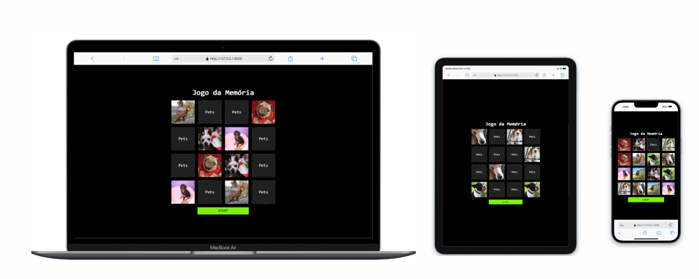

# ⚡ Projeto
## 🚀 Bem-vindo ao projeto: Jogo da Memória Pet!
#### Este projeto foi desenvolvido em:

1. HTML5
2. CSS3
3. Javascript

## Observações Adicionais:
`Projeto desenvolvido com responsividade e semântica, proporcionando uma experiência otimizada aos usuários`

## Pré-requisitos
Ter a extensão Live Server instalado no Visual Studio Code

- Clica com o botão direito do mouse em cima do arquivo index.html
- Escolha a opção Open Width Live Server para subir a aplicação no localhost
- E Pronto! Boa Diversão! 

